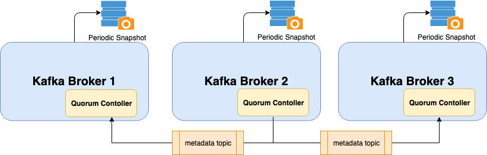

# kafka-3-cluster kraft (3 nodes kafka kraft cluster)

Apache Kafka Raft (KRaft) is the consensus protocol that was introduced to remove Apache Kafka’s dependency on ZooKeeper for metadata management.

Benefits

- Better getting started and operational experience by requiring to run only one system.
- Removing potential for discrepancies of metadata state between ZooKeeper and the Kafka controller
- Improves stability, simplifies the software, and makes it easier to monitor, administer, and support Kafka.
- Allows Kafka to have a single security model for the whole system
- **Provides a lightweight, single process way to get started with Kafka**
- Makes controller failover near-instantaneous
- Simplify the configuration
- The Producer enables the strongest delivery guarantees by default (acks=all, enable.idempotence=true). This means that users now get ordering and durability by default.



  - A major feature that we are introducing with 3.0 is the ability for KRaft Controllers and KRaft Brokers to generate, replicate, and load snapshots for the metadata topic partition named __cluster_metadata. This topic is used by the Kafka Cluster to store and replicate metadata information about the cluster like Broker configuration, topic partition assignment, leadership, etc. As this state grows, Kafka Raft Snapshot provides an efficient way to store, load, and replicate this information.

# Do the same process for three linux servers.

Assume that the servers' ips (10.123.61.61,10.123.61.62,10.123.61.63)

Directory hierarchy

    /app/jdk #jdk folder

    /app/kafka3 #kafka folder

All scripts' paths are depended on the directory hierarchy.

#1 - Download openjdk 11

JDK is a pre-requisite for running kafka

download jdk 11 from the link. (our installation is for linux operating system distribution)

https://jdk.java.net/java-se-ri/11

https://download.java.net/openjdk/jdk11/ri/openjdk-11+28_linux-x64_bin.tar.gz

    tar -zxvf openjdk-11+28_linux-x64_bin.tar.gz

    mv jdk-11 /app/jdk

#2 - Download kafka

download kafka 3.0.0 binary distribution from official site.

https://kafka.apache.org/downloads

https://dlcdn.apache.org/kafka/3.0.0/kafka_2.12-3.0.0.tgz

    tar -zxvf kafka_2.13-3.0.0.tgz

    mv kafka_2.13-3.0.0 kafka3

#3 Create directories for logs, data logs, scripts

create directory for kafka server logs

    mkdir /app/kafka3/logs

create directory for kafka messaging, metadata logs (important logs)

    mkdir /app/kafka3/data/metadata-logs

    mkdir /app/kafka3/data/kraft-combined-logs

create directory for scripts

    mkdir /app/kafka3/scripts

#4 Configure kafka kraft server properties

    cd /app/kafka3/config/kraft

Copy the server.properties as server1.properties

    cp server.properties server1.properties

edit the server1.properties using vim or nano editor.

#Important Configs for the kraft cluster

The role of this server. Setting this puts us in KRaft mode. A node(server) can act as broker, controller or both. The server acts as both a broker and a controller in KRaft mode the below config.
    
    process.roles=broker,controller

The node id associated with this instance's roles. It should be unique for each node.

    node.id=1

The connection string for the controller quorum

    controller.quorum.voters=1@10.123.61.61:19092,2@10.123.61.62:19092,3@10.123.61.63:19092

The address the socket server listens on. The server ip for broker and listener.
broker use 9092 port for clients, controller use 19092 port for quorum in cluster (leader election, data replication)

    listeners=PLAINTEXT://10.123.61.61:9092,CONTROLLER://10.123.61.61:19092
    inter.broker.listener.name=PLAINTEXT

A comma separated list of directories under which to store log files

    log.dirs=/app/kafka3/data/kraft-combined-logs
    
    metadata.log.dir=/app/kafka3/data/metadata-logs
    
The default number of log partitions per topic. More partitions allow greater
parallelism for consumption, but this will also result in more files across
the brokers. The partition number should be proper of cluster node number.

    num.partitions=6

#kraft quorum properties

quorum.voters: This is a connection map which contains the IDs of the voters and their respective endpoint. We use the following format for each voter in the list {broker-id}@{broker-host):{broker-port}. For example, `quorum.voters=1@kafka-1:9092, 2@kafka-2:9092, 3@kafka-3:9092`.

quorum.fetch.timeout.ms: Maximum time without a successful fetch from the current leader before a new election is started.

quorum.election.timeout.ms: Maximum time without collected a majority of votes during the candidate state before a new election is retried.

quorum.election.backoff.max.ms: Maximum exponential backoff time (based on the number if retries) after an election timeout, before a new election is triggered.

quorum.request.timeout.ms: Maximum time before a pending request is considered failed and the connection is dropped.

quorum.retry.backoff.ms: Initial delay between request retries. This config and the one below is used for retriable request errors or lost connectivity and are different from the election.backoff configs above.

quorum.retry.backoff.max.ms: Max delay between requests. Backoff will increase exponentially beginning from quorum.retry.backoff.ms (the same as in KIP-580).

broker.id: The existing broker id config shall be used as the voter id in the Raft quorum.

Each node of cluster server1.properties is under the node-{number} folders.

#5 Generate  the cluster id

    ./bin/kafka-storage.sh random-uuid

Cluster ID : b42Uz-P1SEyPl5jQdNakTm

#6 Format the storage directories

    $ ./bin/kafka-storage.sh format -t b42Uz-P1SEyPl5jQdNakTm -c ./config/kraft/server1.properties

Output :

    Formatting /app/kafka3/data/metadata-logs
    Formatting /app/kafka3/data/kraft-combined-logs

Use the cluster id formatting for all nodes.

#7 kafka bash script for operational process

start, stop, kill, log processes

The kafka.sh file is under the docs.

```bash
#sh_aliases and add following 2 lines:
#
# alias kafka="$KAFKA_SCRIPTS/kafka.sh kafka"
#
# Then use with the following commands:
#
# kafka start|stop|log

KAFKA_DIR="/app/kafka3"
LOG_DIR="${KAFKA_DIR}/logs"

KAFKA_LOG="${LOG_DIR}/kafka.out"

PROGRAM="$1"
COMMAND="$2"

kafkaStart() {
    echo "Starting kafka..."
    rm "${KAFKA_LOG}"
    nohup bash "$KAFKA_DIR/bin/kafka-server-start.sh" "$KAFKA_DIR/config/kraft/server1.properties" >"${KAFKA_LOG}" 2>&1 &
    sleep 2
    echo "Probably it is started..."
        kafkaLog
}

kafkaLog() {
        less +F "${KAFKA_LOG}"
}

kafkaStop() {
        echo "Stopping kafka..."
        PIDS=$(ps -ef | grep "$KAFKA_DIR/config/kraft/server1.properties" | grep kafka | grep java | grep -v grep | awk {'print $2'})
        echo "Kill kafka with process id ${PIDS}"
        kill -s TERM ${PIDS}
}

kafkaPid() {
        PIDS=$(ps -ef | grep "$KAFKA_DIR/config/kraft/server1.properties" | grep kafka | grep java | grep -v grep | awk {'print $2'})
        echo "Kafka PID = ${PIDS}"
}

kafkaKill() {
        echo "Killing kafka..."
        PIDS=$(ps -ef | grep "$KAFKA_DIR/config/kraft/server1.properties" | grep kafka | grep java | grep -v grep | awk {'print $2'})
        echo "Kill kafka with process id ${PIDS}"
        kill -9 ${PIDS}
}

if [ -z "$PROGRAM" ] || [ -z "$COMMAND" ] ; then
        echo "Usage kafka start|stop|log|pid|kill"
        exit 1
elif [ "$PROGRAM" != "kafka" ] ; then
        echo "Invalid program argument: ${PROGRAM}"
        exit 1
elif [ "$COMMAND" != "start" ] && [ "$COMMAND" != "log" ] && [ "$COMMAND" != "stop" ] && [ "$COMMAND" != "pid" ] && [ "$COMMAND" != "kill" ]; then
        echo "Invalid command: ${COMMAND}"
        echo "Available commands: start, log, stop, pid, kill"
        exit 1
else
        echo "Running command ${COMMAND} on program ${PROGRAM}"
fi

if [ "$PROGRAM" = "kafka" ]; then
        if [ "$COMMAND" = "start" ]; then
                kafkaStart
        elif [ "$COMMAND" = "stop" ]; then
                kafkaStop
        elif [ "$COMMAND" = "log" ]; then
                kafkaLog
        elif [ "$COMMAND" = "pid" ]; then
                kafkaPid
        elif [ "$COMMAND" = "kill" ]; then
                kafkaKill
        fi
fi

```

#8 user .bashrc global variables and shortcut settings

alias of kafka scripts

    export KFK_SCRIPTS="/app/kafka3/scripts"
    alias kafka="${KFK_SCRIPTS}/kafka.sh kafka"

set jdk to path

    export JAVA_HOME=/app/jdk
    export PATH=$PATH:$JAVA_HOME/bin

set kafka hep options

    export KAFKA_HEAP_OPTS="-Xmx4096M -Xms512M"

#9 Define as a system service

    [Unit]
    Description=Kafka Service
    
    [Service]
    Type=forking
    User=appuser
    ExecStart=/app/kafka3/scripts/kafka-service-start.sh --no-daemon
    Restart=always
    RestartSec=60
    TimeoutStopSec=60
    TimeoutStartSec=60
    
    [Install]
    WantedBy=default.target


#10 start kafka using alias

kafka start

    [2021-10-09 01:02:00,662] INFO [SocketServer listenerType=BROKER, nodeId=1] Starting socket server acceptors and processors (kafka.network.SocketServer)
    [2021-10-09 01:02:00,665] INFO [SocketServer listenerType=BROKER, nodeId=1] Started data-plane acceptor and processor(s) for endpoint : ListenerName(PLAINTEXT) (kafka.network.SocketServer)
    [2021-10-09 01:02:00,666] INFO [SocketServer listenerType=BROKER, nodeId=1] Started socket server acceptors and processors (kafka.network.SocketServer)
    [2021-10-09 01:02:00,666] INFO Kafka version: 3.0.0 (org.apache.kafka.common.utils.AppInfoParser)
    [2021-10-09 01:02:00,666] INFO Kafka commitId: 8cb0a5e9d3441962 (org.apache.kafka.common.utils.AppInfoParser)
    [2021-10-09 01:02:00,667] INFO Kafka startTimeMs: 1633730520666 (org.apache.kafka.common.utils.AppInfoParser)
    [2021-10-09 01:02:00,668] INFO Kafka Server started (kafka.server.KafkaRaftServer)
    [2021-10-09 01:02:00,702] INFO [BrokerLifecycleManager id=1] The broker has been unfenced. Transitioning from RECOVERY to RUNNING. (kafka.server.BrokerLifecycleManager)
    [2021-10-09 01:02:01,211] INFO [Controller 1] Unfenced broker: UnfenceBrokerRecord(id=1, epoch=19) (org.apache.kafka.controller.ClusterControlManager)

kafka pid

    Running command pid on program kafka
    Kafka PID = 704375

kafka stop

    [2021-10-09 01:03:10,798] INFO [ControllerServer id=1] shutting down (kafka.server.ControllerServer)
    [2021-10-09 01:03:10,798] INFO [SocketServer listenerType=CONTROLLER, nodeId=1] Stopping socket server request processors (kafka.network.SocketServer)
    [2021-10-09 01:03:10,805] INFO [SocketServer listenerType=CONTROLLER, nodeId=1] Stopped socket server request processors (kafka.network.SocketServer)
    [2021-10-09 01:03:10,805] INFO [Controller 1] QuorumController#beginShutdown: shutting down event queue. (org.apache.kafka.queue.KafkaEventQueue)
    [2021-10-09 01:03:10,805] INFO [SocketServer listenerType=CONTROLLER, nodeId=1] Shutting down socket server (kafka.network.SocketServer)
    [2021-10-09 01:03:10,811] INFO [SocketServer listenerType=CONTROLLER, nodeId=1] Shutdown completed (kafka.network.SocketServer)
    [2021-10-09 01:03:10,812] INFO [data-plane Kafka Request Handler on Broker 1], shutting down (kafka.server.KafkaRequestHandlerPool)
    [2021-10-09 01:03:10,817] INFO [data-plane Kafka Request Handler on Broker 1], shut down completely (kafka.server.KafkaRequestHandlerPool)
    [2021-10-09 01:03:10,817] INFO [ExpirationReaper-1-AlterAcls]: Shutting down (kafka.server.DelayedOperationPurgatory$ExpiredOperationReaper)
    [2021-10-09 01:03:10,862] INFO [ExpirationReaper-1-AlterAcls]: Stopped (kafka.server.DelayedOperationPurgatory$ExpiredOperationReaper)
    [2021-10-09 01:03:10,862] INFO [ExpirationReaper-1-AlterAcls]: Shutdown completed (kafka.server.DelayedOperationPurgatory$ExpiredOperationReaper)
    [2021-10-09 01:03:10,863] INFO [ThrottledChannelReaper-Fetch]: Shutting down (kafka.server.ClientQuotaManager$ThrottledChannelReaper)
    [2021-10-09 01:03:11,704] INFO [ThrottledChannelReaper-Fetch]: Stopped (kafka.server.ClientQuotaManager$ThrottledChannelReaper)
    [2021-10-09 01:03:11,704] INFO [ThrottledChannelReaper-Fetch]: Shutdown completed (kafka.server.ClientQuotaManager$ThrottledChannelReaper)
    [2021-10-09 01:03:11,705] INFO [ThrottledChannelReaper-Produce]: Shutting down (kafka.server.ClientQuotaManager$ThrottledChannelReaper)
    [2021-10-09 01:03:11,711] INFO [ThrottledChannelReaper-Produce]: Stopped (kafka.server.ClientQuotaManager$ThrottledChannelReaper)
    [2021-10-09 01:03:11,711] INFO [ThrottledChannelReaper-Produce]: Shutdown completed (kafka.server.ClientQuotaManager$ThrottledChannelReaper)
    [2021-10-09 01:03:11,712] INFO [ThrottledChannelReaper-Request]: Shutting down (kafka.server.ClientQuotaManager$ThrottledChannelReaper)
    [2021-10-09 01:03:12,711] INFO [ThrottledChannelReaper-Request]: Stopped (kafka.server.ClientQuotaManager$ThrottledChannelReaper)
    [2021-10-09 01:03:12,711] INFO [ThrottledChannelReaper-Request]: Shutdown completed (kafka.server.ClientQuotaManager$ThrottledChannelReaper)
    [2021-10-09 01:03:12,711] INFO [ThrottledChannelReaper-ControllerMutation]: Shutting down (kafka.server.ClientQuotaManager$ThrottledChannelReaper)
    [2021-10-09 01:03:13,711] INFO [ThrottledChannelReaper-ControllerMutation]: Stopped (kafka.server.ClientQuotaManager$ThrottledChannelReaper)
    [2021-10-09 01:03:13,711] INFO [ThrottledChannelReaper-ControllerMutation]: Shutdown completed (kafka.server.ClientQuotaManager$ThrottledChannelReaper)
    [2021-10-09 01:03:13,711] INFO [Controller 1] closed event queue. (org.apache.kafka.queue.KafkaEventQueue)
    [2021-10-09 01:03:13,712] INFO App info kafka.server for 1 unregistered (org.apache.kafka.common.utils.AppInfoParser)

#11 Server alarm log error codes

The operation perspective, tail the logs and match the any of following codes (INVALID_CLUSTER_ID,UNKNOWN_LEADER_EPOCH..) and then alarm is executed.


INVALID_CLUSTER_ID: The request indicates a clusterId which does not match the value cached in meta.properties.

FENCED_LEADER_EPOCH: The leader epoch in the request is smaller than the latest known to the recipient of the request.

UNKNOWN_LEADER_EPOCH: The leader epoch in the request is larger than expected. Note that this is an unexpected error. Unlike normal Kafka log replication, it cannot happen that the follower receives the newer epoch before the leader.

OFFSET_OUT_OF_RANGE: Used in the Fetch API to indicate that the follower has fetched from an invalid offset and should truncate to the offset/epoch indicated in the response.

NOT_LEADER_FOR_PARTITION: Used in DescribeQuorum and AlterPartitionReassignments to indicate that the recipient of the request is not the current leader.

INVALID_QUORUM_STATE: This error code is reserved for cases when a request conflicts with the local known state. For example, if two separate nodes try to become leader in the same epoch, then it indicates an illegal state change.

INCONSISTENT_VOTER_SET: Used when the request contains inconsistent membership.


Port check scripts

Check the 9092, 19092 ports, periodically. 

#12 References

    https://github.com/apache/kafka/blob/trunk/config/kraft/README.md
    https://cwiki.apache.org/confluence/display/KAFKA/KIP-595%3A+A+Raft+Protocol+for+the+Metadata+Quorum
    https://adityasridhar.com/posts/how-to-easily-install-kafka-without-zookeeper
    https://developer.confluent.io/learn/kraft/
    https://www.morling.dev/blog/exploring-zookeeper-less-kafka/  
    https://blogs.apache.org/kafka/entry/what-s-new-in-apache6
    https://cwiki.apache.org/confluence/display/KAFKA/KIP-679%3A+Producer+will+enable+the+strongest+delivery+guarantee+by+default
